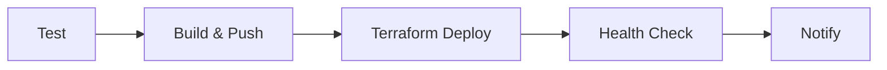

# 🚀 GitHub Actions CI/CD Setup

This document explains how to set up and use the GitHub Actions workflow for VORTEX AI Engine.

## 📋 Prerequisites

### 1. GitHub Repository Setup
- Repository with the VORTEX AI Engine code
- Main branch protection rules (optional but recommended)
- GitHub Actions enabled

### 2. Required GitHub Secrets
Add these secrets to your repository settings (`Settings > Secrets and Variables > Actions`):

```
AWS_ACCESS_KEY_ID      # AWS Access Key for deployment
AWS_SECRET_ACCESS_KEY  # AWS Secret Key for deployment
```

### 3. AWS Prerequisites
- ECR repository: `vortex-ai-orchestrator`
- S3 bucket: `vortex-ai-data-lake-1752530342`
- Route53 hosted zone for `vortexartec.com`
- VPC and subnets configured

## 🏗️ Workflow Overview

The GitHub Actions workflow (`.github/workflows/deploy.yml`) includes:

### 1. **PHP Testing & Code Quality** 🧪
- Runs on PHP 8.1
- Installs Composer dependencies
- Runs PHP CodeSniffer (PSR2 standard)
- Executes PHPUnit tests
- Uploads code coverage to Codecov

### 2. **Docker Image Build & Push** 🐳
- Builds production Docker image
- Tags with timestamp and commit SHA
- Pushes to Amazon ECR
- Creates both versioned and latest tags

### 3. **Terraform Infrastructure Deployment** 🏗️
- Validates Terraform configuration
- Runs `terraform plan`
- Executes `terraform apply` (main branch only)
- Outputs infrastructure details

### 4. **Post-Deployment Health Checks** 🏥
- Waits for services to start
- Checks Vault health endpoint
- Verifies API health endpoint
- Provides deployment summary

## 🔧 Workflow Triggers

### Automatic Triggers
- **Push to main**: Full deployment pipeline
- **Push to develop**: Tests only
- **Pull Request to main**: Tests only

### Manual Trigger
- **Workflow Dispatch**: Manual deployment with environment selection
  - Environment options: `prod`, `staging`, `dev`

## 📊 Workflow Jobs



## 🐳 Docker Image Details

The workflow creates a production-ready Docker image with:
- **Base**: `php:8.1-apache`
- **Web Server**: Apache with mod_rewrite
- **PHP Extensions**: All required extensions for WordPress
- **Composer**: Production dependencies only
- **Health Check**: Built-in health endpoint
- **Security**: Proper file permissions and configuration

## 📦 Deployment Process

1. **Code committed to main branch**
2. **Tests run automatically**
3. **Docker image built and pushed to ECR**
4. **Terraform applies infrastructure changes**
5. **Health checks verify deployment**
6. **Notification sent (success/failure)**

## 🌐 Deployed Services

After successful deployment, the following endpoints are available:
- **Main Website**: `https://vortexartec.com`
- **API Endpoint**: `https://api.vortexartec.com`
- **Vault Portal**: `https://vault.vortexartec.com`
- **WWW Redirect**: `https://www.vortexartec.com`

## 🔒 Security Features

- AWS credentials stored as GitHub secrets
- ECR authentication for Docker image storage
- Terraform state management
- SSL/TLS certificates for all endpoints
- Health check endpoints for monitoring

## 📈 Monitoring & Logs

- **GitHub Actions**: Workflow execution logs
- **CloudWatch**: ECS service and application logs
- **Health Checks**: Automated endpoint verification
- **Terraform**: Infrastructure state tracking

## 🛠️ Manual Deployment

To deploy manually:

1. Go to **Actions** tab in GitHub
2. Select **VORTEX AI Engine - CI/CD Pipeline**
3. Click **Run workflow**
4. Choose environment (prod/staging/dev)
5. Click **Run workflow**

## 🐛 Troubleshooting

### Common Issues

1. **AWS Credentials**: Ensure secrets are correctly configured
2. **ECR Repository**: Verify repository exists and is accessible
3. **Terraform State**: Check S3 backend is configured
4. **Health Checks**: Services may need time to start

### Debug Steps

1. Check workflow logs in GitHub Actions
2. Verify AWS resource status in console
3. Check ECS service logs in CloudWatch
4. Validate Terraform state

## 📝 Customization

### Environment Variables
Modify in `.github/workflows/deploy.yml`:
- `AWS_REGION`: Target AWS region
- `ECR_REPOSITORY`: ECR repository name
- `TERRAFORM_VERSION`: Terraform version
- `PHP_VERSION`: PHP version for testing

### Adding Tests
Add your test files to the project and they will be automatically detected by the workflow.

### Custom Deployment Steps
Modify the workflow file to add additional steps before or after the existing jobs.

## 🚀 Best Practices

1. **Branch Protection**: Enable branch protection on main
2. **Code Reviews**: Require PR reviews before merging
3. **Environment Separation**: Use different AWS accounts/regions
4. **Monitoring**: Set up CloudWatch alerts
5. **Backup**: Regular infrastructure backups
6. **Documentation**: Keep deployment docs updated

## 📞 Support

For issues with the GitHub Actions workflow:
1. Check workflow logs for error details
2. Verify AWS permissions and resources
3. Validate Terraform configuration
4. Review the troubleshooting section above 